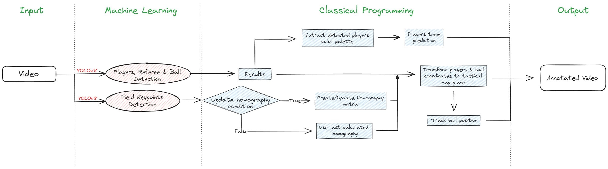

# ⚽ Soccer Detection APP

## Introduction

Welcome to the **Soccer Detection APP** — a smart, Python-based solution for automatic detection and tracking of football players and the ball using **YOLOv8** and **Open-cv**. Designed for coaches, analysts, and football enthusiasts, this app delivers real-time insights, tactical positioning, and annotated visuals from match footage captured by wide-angle cameras.

https://github.com/user-attachments/assets/bab2fc6e-25e9-4a09-8546-bd3dccd3c1bb

## Table of Contents 📑

- [Features](#features)
- [Prerequisites](#prerequisites)
- [Installation](#installation)
- [Usage](#usage)
- [Project Structure](#project-structure)
- [Workflow & Architecture](#workflow-architecture)
- [Technical Overview](#technical-overview)
- [Detection and Tactical Map Logic](#detection-and-tactical-map-logic)
- [Analysis Workflow](#analysis-workflow)
- [Customization](#customization)

## Features

- **YOLOv8 Detection**: Detects players, referees, and the ball with high accuracy (80% - 85%).  
- **Automatic Team Classification**: Assigns players to teams based on dominant color detection.  
- **Tactical Pitch Map**: Visualizes player and ball positions in real-time on a 2D pitch.  
- **Interactive Streamlit UI**: Adjust detection parameters and view annotated video frames.  
- **Hyperparameter Tuning**: Configure detection confidence, annotation options, and motion tolerance.  
- **Export Video Output**: Save annotated sequences for later review or sharing.

## Prerequisites

Before running the app, make sure the following are installed:

- Python 3.10 or above 🐍  
- Conda or pip (for dependency management)  
- YOLOv8 model files (`best.pt`)  
- GPU (optional, but recommended for better performance)

## Installation

1. **Clone the Repository**
   ```bash
   git clone https://https://github.com/OthmanMoussaoui/crafteros.git
   cd playground_detection_process
   ```

## Usage

1. **Launch the App**
    ```bash
    cd Streamlit_web_app
    streamlit run main.py
    ```

2. **Launch the App**

- Choose a match recording to analyze

3. **Configure Settings**

- Adjust team names, team colors, and detection parameters

4. **Start Detection**

- Annotated bounding boxes (players, referee, ball)
  
- Tactical pitch map with live updates

- Export options for saving video

## Project Structure

```plaintext
playground_detection_process/
├── Streamlit_web_app/
│   ├── main.py                  # Main Streamlit app
│   ├── detection.py             # Detection & annotation logic
│   ├── img/                     # Images for UI & documentation
│   ├── vid/                     # Demo videos
│   └── outputs/                 # Annotated video exports
├── models/
│   ├── Yolo8L Players/          # YOLOv8 model for players
│   └── Yolo8M Field Keypoints/  # YOLOv8 model for field keypoints
├── workflow/workflow_diagram.png
├── config pitch dataset.yaml    # Field keypoint configuration
├── config players dataset.yaml  # Player detection config
├── pitch map labels position.json
├── environment.yaml
├── requirements.txt
└── README.md
```

## Workflow & Architecture



## Technical Overview

### Core Technologies

- **Streamlit** : Web interface for uploading videos and displaying analytics
- **YOLOv8** : Object detection engine for players, referees, and the ball
- **OpenCV** : Video handling and frame-by-frame annotation
- **Scikit-image / PIL** : Color management and player team classification
- **Homography Matrix** : Projection from video frame to 2D pitch coordinates

### Detection and Tactical Map Logic

1. **Object Detection** : YOLOv8 detects bounding boxes around players, referees, and the ball.
2. **Keypoints Detection** : Field keypoints are identified to calibrate the pitch.
3. **Homography Projection** : Coordinates are transformed to fit a top-down tactical view.
4. **Team Prediction** : Based on dominant jersey color, each player is assigned to a team.

### Analysis Workflow

1. **Video Load** : Upload or select a match video
2. **Frame-by-Frame Detection** : YOLO detects bounding boxes in each frame.
3. **Field Calibration** : Pitch keypoints are used to align coordinates.
4. **Coordinate Projection** : Players and ball are mapped to the tactical pitch.
5. **Team Classification** : Dominant color extraction classifies teams.
6. **Result Output** : Annotated frames, live tactical view, and optional video export.

### Customization

1. **Team Colors** : Adjust manually if automatic classification is inaccurate.
2. **Detection Parameters** : Tune confidence, nms threshold, and tracking sensitivity.
3. **Field Calibration** : Adapt pitch map labels position.json for different field sizes.


